  <picture>
    <source
      media="(prefers-color-scheme: dark)"
      srcset="https://raw.githubusercontent.com/cludewn/cludewn-assets/refs/heads/main/lockups/SVG/cludewn-lockup-cwn-white.svg"
    >
    
  </picture>

  <a href="https://git.io/typing-svg">
    <picture>
      <source
        media="(prefers-color-scheme: dark)"
        srcset="https://readme-typing-svg.herokuapp.com?font=JetBrains+Mono&weight=500&size=22&duration=2200&pause=1200&color=FFFFFF&center=true&vCenter=true&width=435&lines=Developing+software;Studying+security;Playing+CTFs"
      />
      
    </picture>
  </a>

## Skills

### Languages
  

### Frameworks & Libraries
  

### Tools & Platforms
    

## GitHub Stats

  

  
  

  
  

